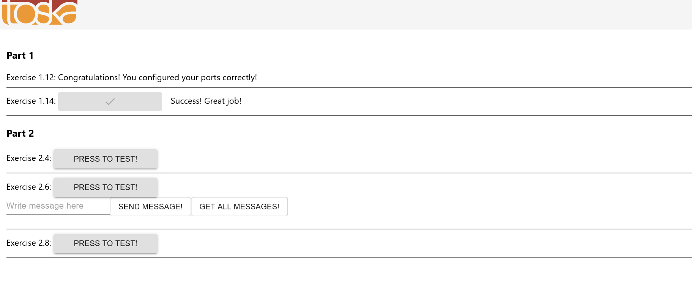

New Docker file for frontend app

```Dockerfile

FROM ubuntu

WORKDIR /usr/src/app

EXPOSE 5000

RUN apt-get update

RUN apt-get install curl -y


RUN curl -sL https://deb.nodesource.com/setup_16.x | bash

RUN apt install -y nodejs

COPY . .

RUN node -v && npm -v

RUN npm install
ENV REACT_APP_BACKEND_URL=http://localhost:3800/

RUN npm run build

RUN npm install -g serve


CMD serve -s -l 5000 build
```

New Docker file for Backend server

```Dockerfile
FROM golang:1.16

ENV GO111MODULE=on \
    CGO_ENABLED=0 \
    GOOS=linux \
    GOARCH=amd64 \
    REQUEST_ORIGIN=http://localhost:3100


ENV GOPATH=/go


WORKDIR /go/src/app
COPY . .

RUN go build


CMD ["./server"]

```


