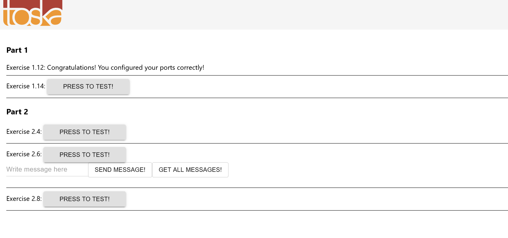

Create a Dockerfile for the project (example-frontend) and give a command so that the project runs in a Docker container with port 5000 exposed and published so when you start the container and navigate to http://localhost:5000 you will see message if you're successful.

```Dockerfile
FROM ubuntu

WORKDIR /usr/src/app

EXPOSE 8080

RUN apt-get update

RUN apt-get install curl -y


RUN curl -sL https://deb.nodesource.com/setup_16.x | bash

RUN apt install -y nodejs

COPY . .

RUN node -v && npm -v

RUN npm install


RUN npm run build

RUN npm install -g serve


CMD serve -s -l 5000 build
```

